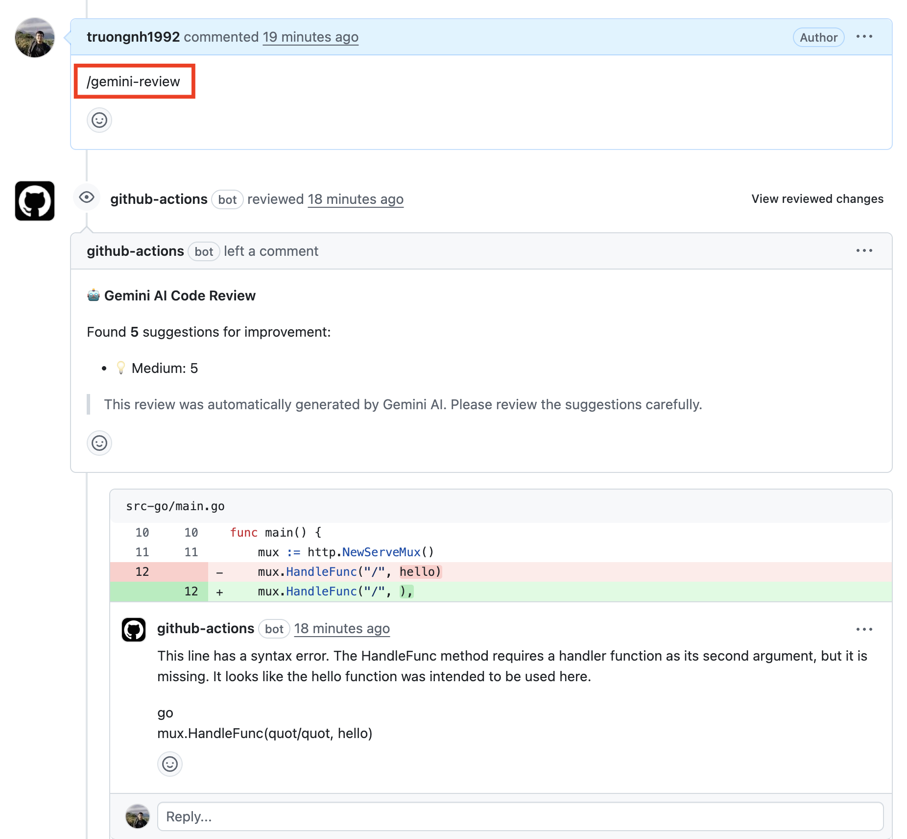

## Google Cloud credits are provided for this project `#VertexAISprint`
Thanks, [Google](https://github.com/google) :)

# Gemini AI Code Reviewer

A GitHub Action that automatically reviews pull requests using Google's Gemini AI.

## Features

- Review your PRs using Gemini API
- Give use comments and suggestions to improve the source codes



[Video Demo](https://www.youtube.com/watch?v=pc1ffEFMIQo)

## Setup

1. To use this GitHub Action, you need an Gemini API key. If you don't have one, sign up for an API key
   at [Google AI Studio](https://makersuite.google.com/app/apikey).

2. Add the Gemini API key as a GitHub Secret in your repository with the name `GEMINI_API_KEY`. You can find more
   information about GitHub Secrets [here](https://docs.github.com/en/actions/reference/encrypted-secrets).

3. Create a `.github/workflows/code-review.yml` file in your repository and add the following content:

### Option 1: Automatic Review on Pull Request Events (Recommended)

This configuration automatically triggers code review when a PR is opened, updated, or reopened:

```yaml
name: AI Code Reviewer

on:
  pull_request:
    branches: [ main ]

permissions:
  issues: write
  pull-requests: write
  contents: read

jobs:
  gemini-code-review:
    runs-on: ubuntu-latest
    steps:
      - name: PR Info
        run: |
          echo "PR Number: ${{ github.event.pull_request.number }}"
          echo "Repository: ${{ github.repository }}"
          echo "Head SHA: ${{ github.event.pull_request.head.sha }}"
          echo "Base SHA: ${{ github.event.pull_request.base.sha }}"

      - name: Checkout Repo
        uses: actions/checkout@v3
        with:
          fetch-depth: 0

      - name: Get PR Details
        id: pr
        run: |
          echo "head_sha=${{ github.event.pull_request.head.sha }}" >> $GITHUB_OUTPUT
          echo "base_sha=${{ github.event.pull_request.base.sha }}" >> $GITHUB_OUTPUT

      - uses: Thomasbehan/gemini-ai-code-reviewer@main
        with:
          GITHUB_TOKEN: ${{ secrets.GITHUB_TOKEN }}
          GEMINI_API_KEY: ${{ secrets.GEMINI_API_KEY }}
          GEMINI_MODEL: gemini-2.5-pro # Optional, default is `gemini-2.5-flash`
          EXCLUDE: "*.md,*.txt,package-lock.json,*.yml,*.yaml"
          SYSTEM_PROMPT: | # Optional: Custom system prompt for code reviews
            Review the code with the following guidelines:
            - Focus on security vulnerabilities and potential bugs
            - Check for proper error handling
            - Ensure code follows best practices
            - Verify performance considerations
```

### Option 2: Manual Trigger via Comment

This configuration requires manual triggering by commenting `/gemini-review` on a pull request:

```yaml
name: Gemini AI Code Reviewer

on:
  issue_comment:
    types: [created]

permissions: write-all

jobs:
  gemini-code-review:
    runs-on: ubuntu-latest
    if: |
      github.event.issue.pull_request &&
      contains(github.event.comment.body, '/gemini-review')
    steps:
      - name: PR Info
        run: |
          echo "Comment: ${{ github.event.comment.body }}"
          echo "Issue Number: ${{ github.event.issue.number }}"
          echo "Repository: ${{ github.repository }}"

      - name: Checkout Repo
        uses: actions/checkout@v3
        with:
          fetch-depth: 0

      - name: Get PR Details
        id: pr
        run: |
          PR_JSON=$(gh api repos/${{ github.repository }}/pulls/${{ github.event.issue.number }})
          echo "head_sha=$(echo $PR_JSON | jq -r .head.sha)" >> $GITHUB_OUTPUT
          echo "base_sha=$(echo $PR_JSON | jq -r .base.sha)" >> $GITHUB_OUTPUT
        env:
          GITHUB_TOKEN: ${{ secrets.GITHUB_TOKEN }}

      - uses: Thomasbehan/gemini-ai-code-reviewer@main
        with:
          GITHUB_TOKEN: ${{ secrets.GITHUB_TOKEN }}
          GEMINI_API_KEY: ${{ secrets.GEMINI_API_KEY }}
          GEMINI_MODEL: gemini-2.5-pro # Optional, default is `gemini-2.5-flash`
          EXCLUDE: "*.md,*.txt,package-lock.json,*.yml,*.yaml"
          SYSTEM_PROMPT: | # Optional: Custom system prompt for code reviews
            Review the code with the following guidelines:
            - Focus on security vulnerabilities and potential bugs
            - Check for proper error handling
            - Ensure code follows best practices
            - Verify performance considerations
```

## Configuration Options

### Required Parameters
- **GITHUB_TOKEN**: GitHub token to interact with the repository (automatically provided by GitHub Actions)
- **GEMINI_API_KEY**: Your Google Gemini API key (store this as a GitHub Secret)

### Optional Parameters
- **GEMINI_MODEL**: The Gemini model to use for code review (default: `gemini-2.5-flash`)
  - `gemini-2.5-flash` is a next-generation model offering speed and multimodal generation capabilities. It's suitable for a wide variety of tasks, including code generation, data extraction, and text editing.
  - `gemini-2.5-pro` offers enhanced capabilities with longer context windows and better reasoning for complex code reviews.
  - For detailed information about available models, refer to [Gemini models](https://ai.google.dev/gemini-api/docs/models/gemini).
  
- **EXCLUDE**: Comma-separated list of file patterns to exclude from review (e.g., `*.md,*.txt,package-lock.json`)
  
- **SYSTEM_PROMPT**: Custom system prompt to define specific rules and guidelines for code reviews
  - If not provided, the action uses a default prompt based on best practices
  - Use this to customize the review focus (e.g., security-first, performance-focused, style-specific)
  - Example:
    ```yaml
    SYSTEM_PROMPT: |
      You are a senior code reviewer. Focus on:
      1. Security vulnerabilities (SQL injection, XSS, etc.)
      2. Performance bottlenecks
      3. Code maintainability and readability
      4. Proper error handling
      Do not comment on minor style issues.
    ```

### AI Model Precision Settings

The action is configured for **maximum precision and deterministic output** to provide consistent, focused code reviews:

- **Temperature**: `0.2` (default) - Lower temperature produces more precise, deterministic responses. The model focuses on the most likely correct answers rather than exploring creative alternatives.
- **Top P**: `0.9` (default) - Slightly lower nucleus sampling for more focused output.
- **Max Output Tokens**: `8192` - Fully utilizes Gemini 2.5's output capacity for comprehensive reviews.

These settings can be overridden via environment variables if you need different behavior:
```yaml
env:
  GEMINI_TEMPERATURE: "0.2"  # Range: 0.0 (deterministic) to 2.0 (creative)
  GEMINI_TOP_P: "0.9"        # Range: 0.0 to 1.0
  GEMINI_MAX_TOKENS: "8192"  # Maximum output tokens
```

**Why these settings?** Code reviews require precision and consistency. Lower temperature ensures the AI focuses on identifying real issues rather than generating creative but potentially irrelevant suggestions.

4. Commit the workflow file to your repository.

5. Usage depends on which option you chose:
   - **Option 1 (Automatic)**: The code review will automatically run when you open, update, or reopen a pull request to the configured branch.
   - **Option 2 (Manual)**: Comment `/gemini-review` on any pull request to trigger the code review.

## How It Works

This GitHub Action uses the Gemini AI API to provide code review feedback. It works by:

1. **Analyzing the changes**: It grabs the code modifications from your pull request and filters out any files you don't want reviewed.
2. **Consulting the Gemini model**: It sends chunks of the modified code to the Gemini for analysis.
3. **Providing feedback**: Gemini AI examines the code and generates review comments.
4. **Delivering the review**: The Action always posts a review on your pull request:
   - If **no issues are found**, the PR is **approved** with a "Code looks good! 👍" message
   - If **issues are found**, the review **requests changes** with detailed comments on specific lines

## License

This project is licensed under the MIT License. See the [LICENSE](LICENSE) file for more information.

## Star History ⭐️

[](https://star-history.com/#truongnh1992/gemini-ai-code-reviewer&Date)