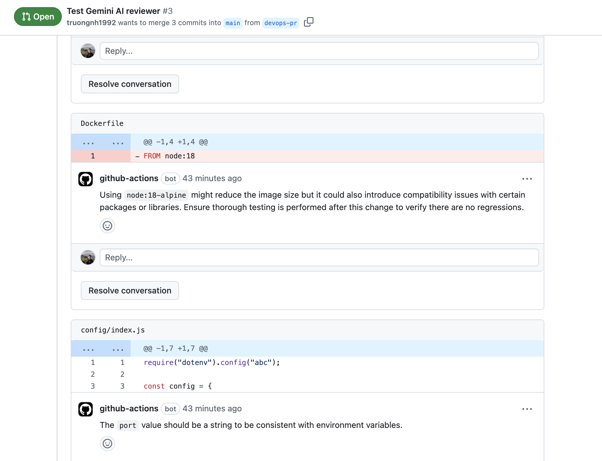

# Gemini AI Code Reviewer

A GitHub Action that automatically reviews pull requests using Google's Gemini AI.

## Features

- Review your PRs using Gemini API
- Give use comments and suggestions to improve the source codes



## Setup

1. To use this GitHub Action, you need an Gemini API key. If you don't have one, sign up for an API key
   at [Google AI Studio](https://makersuite.google.com/app/apikey).

2. Add the Gemini API key as a GitHub Secret in your repository with the name `GEMINI_API_KEY`. You can find more
   information about GitHub Secrets [here](https://docs.github.com/en/actions/reference/encrypted-secrets).

3. Create a `.github/workflows/code-review.yml` file in your repository and add the following content:

```yaml
name: Gemini AI Code Reviewer

on:
  issue_comment:
    types: [created]

permissions: write-all

jobs:
  gemini-code-review:
    runs-on: ubuntu-latest
    if: |
      github.event.issue.pull_request &&
      contains(github.event.comment.body, '/gemini-review')
    steps:
      - name: PR Info
        run: |
          echo "Comment: ${{ github.event.comment.body }}"
          echo "Issue Number: ${{ github.event.issue.number }}"
          echo "Repository: ${{ github.repository }}"

      - name: Checkout Repo
        uses: actions/checkout@v3
        with:
          fetch-depth: 0

      - name: Get PR Details
        id: pr
        run: |
          PR_JSON=$(gh api repos/${{ github.repository }}/pulls/${{ github.event.issue.number }})
          echo "head_sha=$(echo $PR_JSON | jq -r .head.sha)" >> $GITHUB_OUTPUT
          echo "base_sha=$(echo $PR_JSON | jq -r .base.sha)" >> $GITHUB_OUTPUT
        env:
          GITHUB_TOKEN: ${{ secrets.GITHUB_TOKEN }}

      - uses: truongnh1992/gemini-ai-code-reviewer@latest
        with:
          GITHUB_TOKEN: ${{ secrets.GITHUB_TOKEN }}
          GEMINI_API_KEY: ${{ secrets.GEMINI_API_KEY }}
          GEMINI_MODEL: gemini-1.5-pro-002 # Optional, default is `gemini-1.5-flash-002`
          INPUT_EXCLUDE: "*.md,*.txt,package-lock.json,*.yml,*.yaml"
```
> if you don't set `GEMINI_MODEL`, the default model is `gemini-1.5-flash-002`. `gemini-1.5-flash-002` can be used for generating code, extracting data, edit text, and more. Best for tasks balancing performance and cost. For the detailed information about the models, please refer to [Gemini models](https://ai.google.dev/gemini-api/docs/models/gemini).
4. Commit codes to your repository, and working on your pull requests.
5. When you're ready to review the PR, you can trigger the workflow by commenting `/gemini-review` in the PR.

## How It Works

This GitHub Action uses the Gemini AI API to provide code review feedback. It works by:

1. **Analyzing the changes**: It grabs the code modifications from your pull request and filters out any files you don't want reviewed.
2. **Consulting the Gemini model**: It sends chunks of the modified code to the Gemini for analysis.
3. **Providing feedback**: Gemini AI examines the code and generates review comments.
4. **Delivering the review**: The Action adds the comments directly to your pull request on GitHub.

## License

This project is licensed under the MIT License. See the [LICENSE](LICENSE) file for more information.
